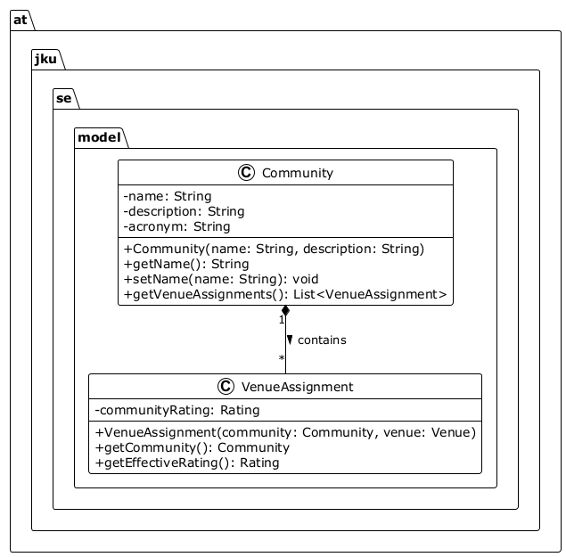

# Sprint Planning Guide -- Release 2 (R2)

**Deadline:** 16 May 2026, 12:00 | **Review:** 19 May 2026 | **Project Meeting:** 05 May 2026

---

## 1. What Changes from R1 to R2

R1 was design. R2 is **implementation**: working code, tested, with proper development process. Evaluation shifts to code quality, unit tests, and workflow discipline.

## 2. Requirement Priorities

| Priority | BRs | What | Target |
|----------|-----|------|--------|
| **Must have** | BR-01 to BR-09 | CRUD Community/Conference/Journal, venue assignment, DBLP import, list communities | R2 |
| **Must have** | BR-10 to BR-13 | Import/export definitions, community overlap, researcher activity, inactive researchers | R3 |
| **Nice to have** | BR-14 to BR-20 | Filtering, sorting, rankings, rating import (GII-GRIN-SCIE, SJR), graphical reports | R3/Final |

For R2: focus on getting CRUD for 2-3 entities fully working with tests. DBLP import can be started but does not need to be complete. Analysis features (BR-10 to BR-13) require working CRUD and imported data -- plan them for R3.

## 3. R2 Deliverables

| # | Deliverable | Key |
|---|-------------|-----|
| 1 | Extended UML diagrams | Editable source (.puml/.drawio) + PNG |
| 2 | First working functionality | At least 1 SR fully implemented end-to-end |
| 3 | Unit tests | JUnit 5 for Model and Service classes |
| 4 | User Stories with Acceptance Criteria | Concrete, testable, linked to SR |
| 5 | Code Quality Report | 2 SonarQube issues identified and fixed |

## 4. Diagrams to Maintain

Your project needs **up to 3 diagrams**, each with a different role:

| Diagram | UML Type | Required | Shows |
|---------|----------|----------|-------|
| **Domain Model** | Class Diagram | Always | Entities in `model` package: attributes, methods, relationships, multiplicities |
| **MVC Architecture** | Class Diagram with packages, or Component Diagram | Always | Layer separation (View/Controller/Service/Model/Repository) and dependencies |
| **ER Diagram** | Entity-Relationship | Only with DB | Tables, columns, PK/FK constraints |

The Domain Model shows **what** your application manages. The MVC diagram shows **how** the code is structured. The ER diagram shows **where** data is stored.

**Rules:** Always commit editable source files, not just PNG. The Domain Model must not contain controllers or services. The MVC diagram must not contain entity details (those go in the Domain Model). If you use PostgreSQL, every ER table must correspond to a class in the Domain Model.

**Minimal PlantUML example** -- a Domain Model with 2 classes and 1 composition:



Source: [`domain-model-example.puml`](domain-model-example.puml) -- to generate the PNG, paste the `.puml` source into the [PlantUML Web Editor](https://www.plantuml.com/plantuml/uml) or use the PlantUML extension in VS Code / IntelliJ.

## 5. GitHub Project Board

The board should contain **actionable work items** -- issues that are assigned to one person, have acceptance criteria, and are linked to a branch and PR.

**What are actionable items?** Either User Stories or fine-grained Software Requirements, depending on how your team works. Business Requirements (BR-01 to BR-20) are the course catalog and are NOT actionable work items.

**If your board already has a mix of BRs, SRs, and USs:** do not delete or reorganize. Instead, make sure every issue has the correct label (`business-requirement`, `software-requirement`, or `user-story`) and create a **filtered view** on your Project board that shows only your work items (hiding BRs). This gives you a clean sprint view without losing any existing work.

Regardless of how you organize, every board item you work on must have:
- Exactly one assignee
- Acceptance criteria
- A feature branch and a Pull Request
- A milestone (R2)

**Board columns:** Backlog, Todo, In Progress, In Review, Done.

**Recommended custom fields:**

| Field | Type | Purpose |
|-------|------|---------|
| Estimate (h) | Number | Track effort |
| Priority | Single select (High/Medium/Low) | Sprint prioritization |

## 6. Sprint Planning Steps

1. **Review R1 feedback** -- all action items marked `[ ]` are mandatory for R2
2. **Select 2-3 SRs** to implement. Prioritize end-to-end delivery over breadth
3. **Create User Stories** with Acceptance Criteria, estimates, and assignees
4. **Set up GitHub Issues:**
   - Create issues for SRs (label `software-requirement`) and USs (label `user-story`)
   - Set milestone R2 on all
   - Add your **board items** (US or SR, depending on your team's choice -- see section 5) to the Project board
   - Assign each board item to one team member
5. **Distribute work equally** -- every member must have assigned issues
6. **Budget time for tests** -- plan ~30% of implementation time for unit tests

## 7. Development Workflow (Mandatory)

```
1. Pick a US from the board -> move to "In Progress"
2. Create branch:  git checkout -b feature/US-NNN-short-description
3. Implement + write unit tests
4. Verify:         mvn clean verify
5. Commit:         git commit -m "Implement feature X #42"
6. Push + create Pull Request
7. CI green -> teammate reviews -> merge to main
8. Close US, move to "Done"
```

**Rules:**

| Rule | Minimum |
|------|---------|
| Feature branches | 1 per US, never commit to `main` directly |
| Pull Requests | 1 per US, reviewed by a teammate |
| Commit references | >= 50% of commits reference an issue (`#N`) |
| Weekly commits | Every member, every week |

## 8. Unit Tests

Test **Model** and **Service** classes (not UI controllers). Cover normal cases, edge cases, and validation errors.

```java
@Test
void createCommunity_withBlankName_shouldThrowException() {
    assertThrows(IllegalArgumentException.class,
        () -> new Community("", "description"));
}
```

**Target: >= 85% branch coverage on non-UI code.** Start building toward this at R2 -- it must be met by R3.

Run: `mvn clean verify` -- coverage report at `target/site/jacoco/index.html`.

## 9. SonarQube

Run SonarQube, pick 2 issues (bugs, code smells, or security hotspots), fix them, and present the before/after during R2 Review.

## 10. Submission Checklist

- [ ] All R2 User Stories closed with DoD met
- [ ] All code on `main` via merged PRs
- [ ] `git tag R2 && git push origin R2`
- [ ] `git checkout -b release/R2 && git push origin release/R2`
- [ ] UML diagrams updated (editable source + PNG)
- [ ] `mvn clean verify` green
- [ ] SonarQube analysis run
- [ ] GitHub Project board up to date
- [ ] All R1 feedback action items addressed
