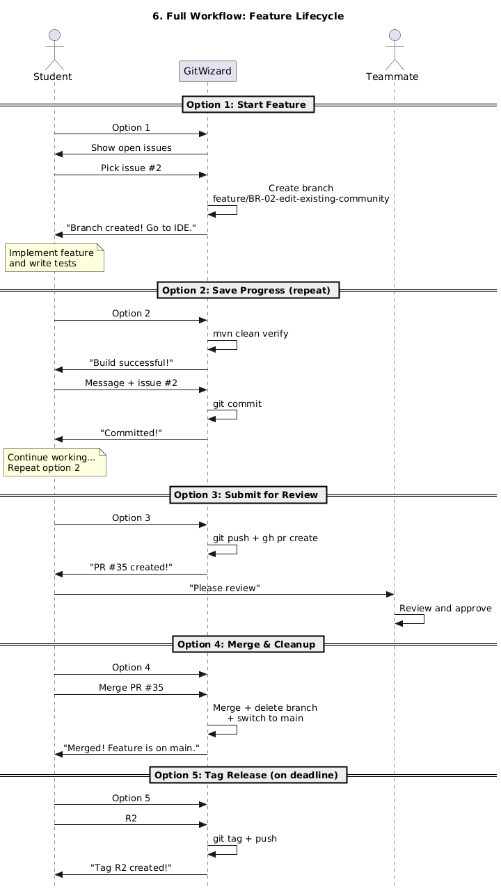
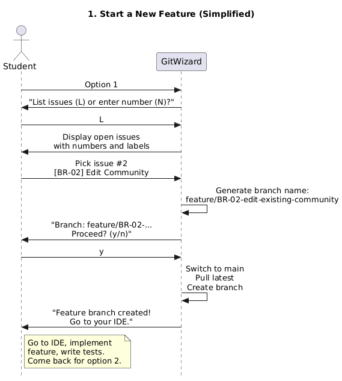
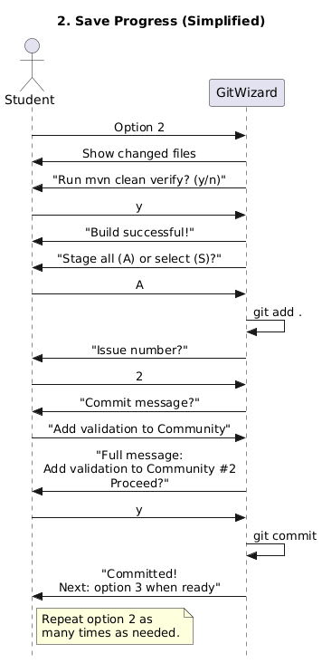
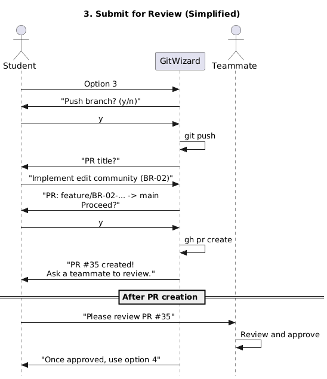
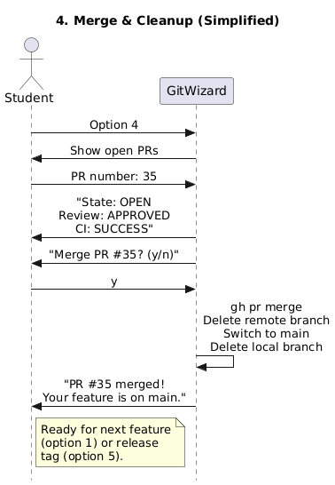
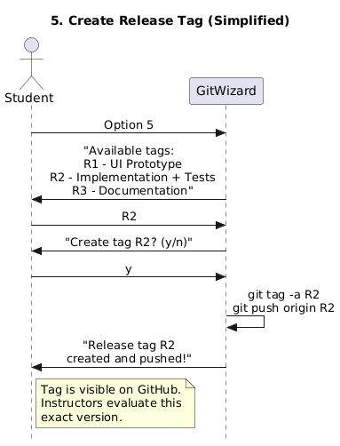

# Git Wizard — SE-Praktikum SS 2026

An interactive command-line tool that guides you through the Git workflow required for this course. It helps you create branches, commit with proper messages, open Pull Requests, merge, and tag releases — step by step.

## Requirements

- **git** installed and configured ([download](https://git-scm.com/downloads))
- **GitHub CLI (`gh`)** installed and authenticated ([download](https://cli.github.com/))
  ```powershell
  gh auth login
  ```
- Run the wizard **from inside your cloned project repository**

## Quick Start

Open PowerShell, navigate to your project, and run:

```powershell
cd C:\path\to\your-project
.\tools\GitWizard.ps1
```

You will see an interactive menu:

```
+------------------------------------------------------------+
|          SE-Praktikum Git Wizard  (SS 2026)                |
|          JKU Linz - Software Engineering                   |
+------------------------------------------------------------+

  1. Start a new feature       (create branch)
  2. Save progress             (commit)
  3. Submit for review         (push + create PR)
  4. Merge & cleanup           (after PR approved)
  5. Create release tag        (R1 / R2 / R3)
  6. Check my status           (branch, changes, PRs)

  ?  Help overview    1?..6?  Help on a specific command
  Q  Quit
```

## Getting Help

**From the command line:**

```powershell
.\tools\GitWizard.ps1 -Help          # Overview
.\tools\GitWizard.ps1 -Help 1        # Detailed help for option 1
.\tools\GitWizard.ps1 -Help 3        # Detailed help for option 3
```

**From inside the wizard menu:** type `?` for an overview or `1?` through `6?` for details.

---

## Workflow at a Glance



> [View detailed version with Git/GitHub internals](diagrams/06-full-workflow.png)

---

## 1. Start a New Feature

Pick an issue from your GitHub board and create a properly named feature branch.



> [View detailed version](diagrams/01-start-feature.png)

Branch naming is automatic based on the issue type:
- `[BR-02] Edit Community` → `feature/BR-02-edit-existing-community`
- `[SR-01.1] Parse DBLP` → `feature/SR-01.1-parse-dblp-xml`
- `[US-005] Create dialog` → `feature/US-005-create-community-dialog`

---

## 2. Save Progress (Commit)

Stage changes, optionally run tests, and commit with a message that references the issue.



> [View detailed version](diagrams/02-save-progress.png)

Every commit message **must** include `#<issue-number>`:
```
Add validation to Community #2
```

---

## 3. Submit for Review (Push + Create PR)

Push your branch and create a Pull Request. Then ask a teammate to review.



> [View detailed version](diagrams/03-submit-for-review.png)

---

## 4. Merge & Cleanup

After your PR is approved and CI passes, merge into `main` and clean up.



> [View detailed version](diagrams/04-merge-cleanup.png)

---

## 5. Create Release Tag

On release day, tag the current commit on `main`.



> [View detailed version](diagrams/05-create-release-tag.png)

---

## Rules to Remember

- **Never commit directly to `main`** — always use a feature branch
- **Every commit must reference an issue** with `#N` in the message
- **Every feature needs a Pull Request** with at least one approving review
- **Commit at least once per week** — regular progress is expected
- **Tag each release** (R1, R2, R3) on `main` before the deadline
- **Run `mvn clean verify`** before committing to catch errors early
